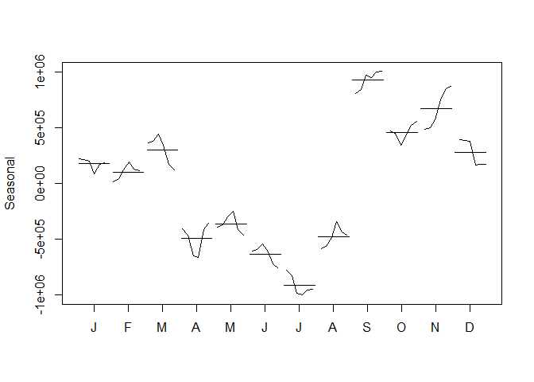

# Forecasting Chulwalar Exports
Dennis Murray  
July 25, 2016  


####Introduction
The island of Chulwalar, part of the Urbano chain of islands, has several exports that provide the majority of the economy for the country.  The leadership of the country wishes to forecast the export of these products, in total, to a higher degree of accuracy.

The exports are all winter-blooming plants, and thus will be subject to major seasonal effects.  


####Import and Formatting of the Data


```r
source("Analysis/LoadFiles.R")
```

```
## Loading required package: forecast
```

```
## Loading required package: zoo
```

```
## 
## Attaching package: 'zoo'
```

```
## The following objects are masked from 'package:base':
## 
##     as.Date, as.Date.numeric
```

```
## Loading required package: timeDate
```

```
## This is forecast 7.1
```

```
## Loading required package: fma
```

```
## Loading required package: tseries
```

```
## Loading required package: expsmooth
```

```
## Loading required package: lmtest
```

The data represents monthly export data from 2008 through 2014, as well as monthly economic indicators and planned export data.  It will necessary to convert the data from the tabular format presented from the Chulwalar data to a time series format.


```r
source("Analysis/TimeSeriesMe.R")
```

####Exploration of the Data


```r
source("Analysis/ExploreExports.R")
```

<!-- -->

Based on the Loess seasonal decomposition, it appears there is a strong, nearly linear trend from 2008 to 2014 for Total Exports.  Seasonality appears to be increasing its influence as well over time.  The remainder component of the decomposition also shows some degree of intensifying over time as well.  However, the random does stay centered with nearly an equal number of observations greater than, and less than zero.


```r
source("Analysis/ExploreSeasonal.R")
```

<!-- -->


####Forecast Hypothesis


####Review of Accuracy


####Conclusion


####Appendix
