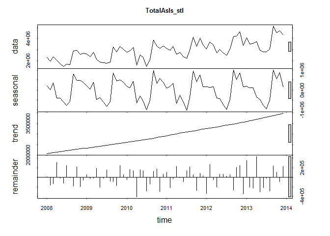

# Forecasting Chulwalar Exports
Dennis Murray  
July 25, 2016  


```r
knitr::opts_chunk$set(echo = TRUE)
```

####Introduction
The island of Chulwalar, part of the Urbano chain of islands, has several exports that provide the majority of the economy for the country.  The leadership of the country wishes to forecast the export of these products, in total, to a higher degree of accuracy.

The exports are all winter-blooming plants, and thus will be subject to major seasonal effects.  


####Import and Formatting of the Data


The data represents monthly export data from 2008 through 2014, as well as monthly economic indicators and planned export data.  It will necessary to convert the data from the tabular format presented from the Chulwalar data to a time series format.  The conversion is being handled in a Makefile, but details can be seen via exploration of the Github repository.


####Exploration of the Data


```r
source("Analysis/ExploreExports.R")
```

<!-- -->

Based on the Loess seasonal decomposition, it appears there is a strong, nearly linear trend from 2008 to 2014 for Total Exports.  Seasonality appears to be increasing its influence as well over time.  The remainder component of the decomposition also shows some degree of intensifying over time as well.  However, the random does stay centered with nearly an equal number of observations greater than, and less than zero.


```r
source("Analysis/ExploreSeasonal.R")
```

<!-- -->

Examining our seasonal component more closely, we can see pealk months for Total Seasonality to exist in the September to November time period, slightly lowerin the December-March time period, and then the lowest part of the season in April through August.  The lowest month of the full year is July, followed by June.


```r
source("Analysis/TestCorr.R")
Sorted
```

```
##                        Field  Correlation
## 4                Temperature -0.342968353
## 5                     Births -0.119022771
## 11          NationalHolidays -0.007883708
## 13                 Inflation  0.002438708
## 3                      SIGov  0.200776772
## 15 InfluenceNationalHolidays  0.371746344
## 14  IndepdendenceDayPresents  0.435952243
## 10                   PPIEtel  0.483612872
## 12            ChulwalarIndex  0.483701664
## 6                   SIExtern  0.588312219
## 9                       AEPI  0.625232002
## 8  GlobalisationPartyMembers  0.630083988
## 7              UrbanoExports  0.638177983
## 21                      CEPI  0.663924973
## 2                  TotalPlan  0.918340186
```


####Forecast Hypothesis

Our selection of a forecast model will need to balance the principle of Occam's Razor, calling for the simplest possible model, with the selection of a model that allows for enough complexity to address the seasonality that we have seen present in the data set for Total Exports.


```r
source("Analysis/ModelSES.R")
source("Analysis/ModelHW.R")
source("Analysis/ModelHW2.R")
source("Analysis/ModelHW3.R")
source("Analysis/ModelHW4.R")
source("Analysis/ModelHW5.R")
source("Analysis/ModelHW6.R")
```

Model_ses: Simple Exponential Smoothing

Model_holt_1: Basic Holt Winters Model

Model_holt_2: Holt Winters with Exponential Trend

Model_holt_3: Holt Winters with Damped Trend

Model_holt_4: Holt Winters with Exponential and damped trend

Model_hw_1: Holt Winters Additive Seasonal Trend

Model_hw_2: Holt Winters Multiplicative Seasonal Trend


####Review of Accuracy

To evaluate the overall accuracy of each forecast, we will review the error calculations provided for each forecast from the accuracy command in the forecast library.


```r
source("Analysis/CalcFcstAccuracy.R")
ModelAccuracy[,1:6]
```

```
##                     ME     RMSE      MAE         MPE      MAPE      MASE
## Model_ses     47469.84 609507.0 429997.1 -1.51100757 15.023364 1.1720741
## Model_holt_1 -16586.90 608119.1 441110.7 -3.88925005 15.753073 1.2023674
## Model_holt_2  37825.61 609787.5 433018.9 -1.83821394 15.184870 1.1803109
## Model_holt_3  15578.94 608787.2 436909.7 -2.79761246 15.465259 1.1909164
## Model_holt_4  46119.56 609906.7 432069.1 -1.54911403 15.119870 1.1777219
## Model_hw_1    21615.43 241685.0 202218.5 -0.08252109  7.329458 0.5512016
## Model_hw_2    17434.11 235296.6 191805.3 -0.32928095  7.213472 0.5228175
```

The Model_holt_3, A damped trend, has the best absolute performance for Mean Error (ME) at 15,578, slightly better than the Model_holt_1 and Model_hw_2.

For Root Mean Squared Error (RMSE), the Model_hw_2 and Model_hw_1 far outperform the rest of the models.

For Mean Absolute Error (MAE), the Model_hw_2 and Model_hw_1 are first and second respectively.  

For Mean percentage error (MPE), the Model_Hw_1 is the best absolute performer at 8.3%, followed by the model_Hw_2.

For Mean Absolute Percentage Error, the Model_hw_1 and Model_hw_2 both are nearly equal at 7.3 and 7.2%.

Finally, the Model_hw_2 and the Model_hw_1 have values of 0.52 and 0.55 respectively.

Overall, the Model_hw_1 had one first place finish in accuracy scores, and four second place finishes in accuracy scores.

The model_hw_2, Holt Winters with a Multiplicative Seasonal trend is our most accurate, placing first in accuracy for four scores and second in two.

Therefore, we will select the Holt Winters with Multiplicative Seasonal trend as our forecast model.

####Conclusion


```r
par(mfrow=c(1,2))
plot(Model_hw_1)
plot(Model_hw_2)
```

<!-- -->

The selected model, a Holt-Winters with a multiplicative seasonal trend, reflects both of the observations made in the review of the seasonal decomposition: a strong continued trend of increased year-over-year volume, as well as the continued seasonal fluctuation that has marked the history of Chulwalar exports since 2008.  

The model was selected as a result of its consistency in terms of the lowest, or nearly the lowest forecast error across a number of different measures.

Examining against the second best solution, the additive seasonal trend, the forecast shows a greater "trough" for the lowest months of the year than the additive trend does.  
